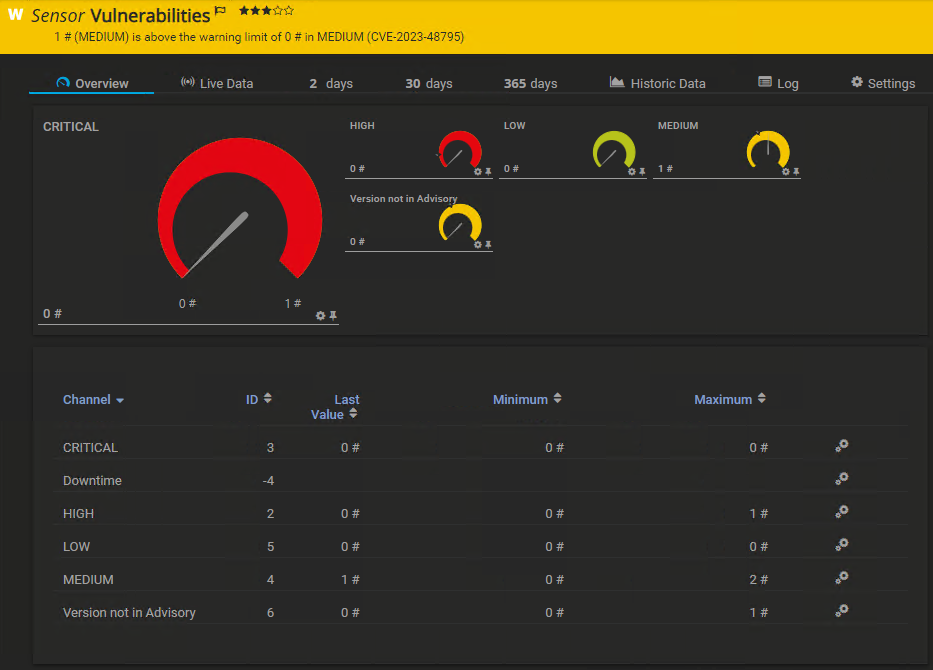

# PRTG Sensor for PAN-OS Vulnerability Monitoring

## Summary
This script can be used by PRTG as a custom (advanced) EXE/Script sensor.  
It queries the firewall's PAN-OS version via SNMP and check's it against the PaloAlto Security Advisory API for vulnerabilities.  

The script can be either used by the _Advanced EXE/Script_ sensor by setting the _-advanced_ parameter, or by the "normal" _EXE/Script_ sensor.  
The advanced mode will show each severity as a own sensor channel, and return a list of open CVE-ID's as the sensor status code.  
In "normal" mode, only the amount of relevant vulnerabilities will be returned.  

If there are no vulnerabilities related to a specific PAN-OS version, the Security Advisory API will respond with _"Unable to find product."_.  
In this case, the value of thesensor channel _Version not in Advisory_ will be set to 1.

Security Advisory: https://security.paloaltonetworks.com



## Configuration
- Save the script into _Custom Sensors\EXE_ and create a hardlink onto _Custom Sensors\EXEXML_:  
```
mklink -H "<PRTG>\Custom Sensors\EXE\Get-PANOS-Advisories.ps1" "<PRTG>\Custom Sensors\EXEXML\Get-PANOS-Advisories.ps1"
```

- Add a new _EXE/SCRIPT_ or _Advanced EXE/SCRIPT_ sensor in PRTG and choose _Get-PANOS-Advisories.ps1_ as _EXE/Script_.  

- Enter your parameters (see _Usage_ for all available parameters), e.g.:  
```
-ip %host -advanced -severities "CRITICAL", "HIGH", "MEDIUM", "LOW"
```

## Exclude CVE's
If you want to exclude certain CVE's from being reported, e.g. if you know a certain CVE may apply to your PAN-OS version, but not your configuration, you can use the **-exclude** parameter.  
For Example:  
```
-ip %host -advanced -severities "CRITICAL", "HIGH", "MEDIUM", "LOW" -exclude "CVE-2024-3382", "CVE-2024-3381"
```


## Recommended Limits:  

Set _Upper Error Limit_ for _CRITICAL_ and _HIGH_ to 0,  
_Upper Warning Limit_ for _Medium_ to 0  
and _Upper Warning Limit_ for _Version not in Advisory_ to 0.  

## Dependencies
- PowerShell SNMP module (https://www.powershellgallery.com/packages/SNMP/1.0.0.1)

## Usage
```
NAME
    Get-PANOS-Advisories.ps1
    
SYNOPSIS
    Retrieves security advisories from Palo Alto Networks API.
    
    
SYNTAX
    Get-PANOS-Advisories.ps1  [[-ip] <String>] [[-community] <String>] [[-panos] <String>] [[-severities] <String[]>] [[-sort] <String>] [-advanced] [[-exclude] <String[]>] [<CommonParameters>] 

    
    
DESCRIPTION
    This script retrieves security advisories from the Palo Alto Networks API for the specified PAN-OS version.
    

PARAMETERS
    -ip <String>
        Private IP-Adress of the PaloAlto firewall that will be queried for it's PAN-OS version using SNMP.
        Firewall must be accessible on UDP 161 and have SNMP V2 enabled for community "public".
        If -ip is specified, -panos will be ignored.
        
        Required?                    false
        Position?                    1
        Default value                
        Accept pipeline input?       false
        Accept wildcard characters?  false

    -community <String>
        SNMP community defined on the PaloAlto firewall. Default is "public".
        If -panos is specified, -community will be ignored.
        
        Required?                    false
        Position?                    2
        Default value                public
        Accept pipeline input?       false
        Accept wildcard characters?  false 
        
    -panos <String>
        The PAN-OS version for which advisories are retrieved.
        If -ip is specified, -panos will be ignored.
        
        Required?                    false
        Position?                    2
        Default value                
        Accept pipeline input?       false
        Accept wildcard characters?  false
        
    -severities <String[]>
        An array of severity levels to filter the advisories. Options are "HIGH", "CRITICAL", "MEDIUM", "LOW", "NONE".
        
        Required?                    false
        Position?                    3
        Default value                @("HIGH", "CRITICAL")
        Accept pipeline input?       false
        Accept wildcard characters?  false
        
    -sort <String>
        The sorting order for advisories. Options are: "cvss", "doc", "date", "updated". "-" before any option will invert the sorting, e.g. "-cvss"
        
        Required?                    false
        Position?                    4
        Default value                -cvss
        Accept pipeline input?       false
        Accept wildcard characters?  false
        
    -advanced [<SwitchParameter>]
        Return count and CVE-ID as XML. Can be used for PRTG Advanced EXE/Script Sensor.
        Otherwise only the total amount of matched CVE's is returned. 
        
        Required?                    false
        Position?                    named
        Default value                False
        Accept pipeline input?       false
        Accept wildcard characters?  false

     -exclude <String[]>
        List of CVE-ID's to be excluded.
        
        Required?                    false
        Position?                    6
        Default value                @()
        Accept pipeline input?       false
        Accept wildcard characters?  false 

        
    <CommonParameters>
        This cmdlet supports the common parameters: Verbose, Debug,
        ErrorAction, ErrorVariable, WarningAction, WarningVariable,
        OutBuffer, PipelineVariable, and OutVariable. For more information, see 
        about_CommonParameters (https:/go.microsoft.com/fwlink/?LinkID=113216). 
    
NOTES
        Author: Felix Schwärzler
        Date: 15.04.2024
        Version: 1.0
        GitHub: https://github.com/stayfesch/Get-PANOS-Advisories
        
        Requires SNMP Powershell Module (https://www.powershellgallery.com/packages/SNMP/1.0.0.1)

EXAMPLES
    -------------------------- EXAMPLE 1 --------------------------
    PS .\Get-PANOS-Advisories.ps1 -ip "192.168.0.254" -severities "CRITICAL", "HIGH", "MEDIUM" -advanced
    Will query the PAN-OS version 192.168.0.254 via SNMP and return all CRITICAL, HIGH and MEDIUM advisories as XML.

    -------------------------- EXAMPLE 2 --------------------------
    PS .\Get-PANOS-Advisories.ps1 -ip "192.168.0.254"
    Will query the PAN-OS version 192.168.0.254 via SNMP and return the amount of critical and high vulnerabilities.
    
    -------------------------- EXAMPLE 3 --------------------------
    PS .\Get-PANOS-Advisories.ps1 -panos "10.1.11-h4" -severities "MEDIUM", "LOW"
    Will return the amount of vulnerabilities for PAN-OS version 10.1.11-h4 with the severitie MEDIUM or LOW
    
    
    
    
RELATED LINKS
    https://security.paloaltonetworks.com
    https://security.paloaltonetworks.com/api
    https://www.powershellgallery.com/packages/SNMP/1.0.0.1  
    https://github.com/stayfesch/Get-PANOS-Advisories
```